# SubtitleBuddy

## Project Overview
AWS cloud-based web application that takes video as input, automatically detects multiple languages used and sends subtitle file in email.

## Table of Contents
  - [Technology Overview](#technology-overview)
  - [Architecture](#architecture)
  - [Flow of Execution](#flow-of-execution)
  - [Part-1: Project Setup Steps](#part-1-project-setup-steps)
    - [1. Create S3 bucket for frontend src code](#1-create-s3-bucket-for-frontend-src-code)
    - [2. Provision the AWS Resources](#2-provision-the-aws-resources)
  - [Part-2: Using the Web App](#part-2-using-the-web-app)
  - [Extras](#extras)
    - [1. Video with Full Explanation, Provisioning, and Demo](#video-with-full-explanation-provisioning-and-demo)
    - [2. Why Pre-signed URL for S3?](#why-pre-signed-url-for-s3)
  - [Notes](#notes)

## Technology Overview
 - **Frontend**: `Docker + React`, deployed on `AWS Elastic Beanstalk`
 - **Backend**: `Nodejs` functions deployed on `AWS Lambda` & Exposed via `AWS API Gateway`
 - **Video & Subtitle Storage**: `AWS Simple Storage Service (S3)` 
 - **Subtitle Generation**: `Amazon Transcribe`
 - **Triggering Lambda**: `Amazon EventBridge`
 - **Email**: `Amazon Simple Email Service (SES)` 
 - For **Infrastructure as Code (IaC)**: `AWS CloudFormation` 
 - **Logging**: `AWS CloudWatch`

## Architecture

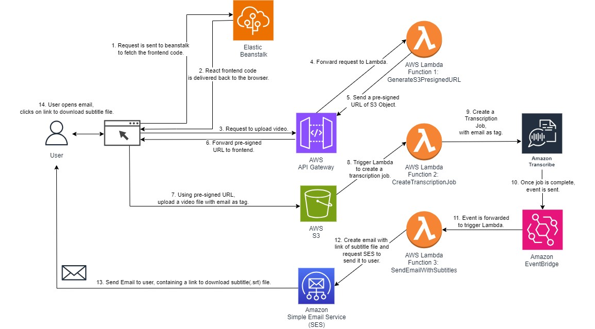

**Note**: To understand all these steps, check flow of execution section after components.

### Components:

1. **AWS Lambda**: 3 Lambda functions are created, for creating pre-signed S3 URLs, 
creation of transcription Job and sending email via SES service. Scales automatically as per the incoming traffic.

2. **AWS Elastic Beanstalk**: Used to host containerized React frontend code. Provisions a scalable setup using EC2, Load Balancer and Auto Scaling group, without any extra configurations.

3. **Amazon S3**: Used to store the input video files uploaded by users, as well as the generated subtitle files (.srt). For .srt files, amazon managed S3 URL is generated by the Transcribe service itself. It provides scalable and durable object storage with high availability.

4. **AWS API Gateway**: Exposes 1 Lambda function, which generates a pre-signed S3 URL, as REST API to the frontend.

5. **Amazon EventBridge**: Used to trigger the Lambda function responsible for sending emails via SES when a transcription job is completed in Amazon Transcribe.

6. **Amazon Simple Email Service (SES)**: Used to send well-formatted emails containing the download link for the subtitle files to the users' specified email address.

7. **Amazon Transcribe**: Utilized for generating transcriptions of the uploaded video files. This service automatically detects multiple languages (For eg: French and English in a single video) and generates subtitle files (.srt) based on the spoken content in the videos.

## Flow of Execution

1. The user opens the browser, and enters the URL to access the frontend of SubtitleBuddy, the request goes to AWS Elastic Beanstalk (Loadbalancer, AutoScalingGroup and EC2 behind the scenes).

2. The React frontend code is delivered by Elastic Beanstalk (Loadbalancer, AutoScalingGroup and EC2 behind the scenes) to the browser.

3. The user enters the email, selects the video and hits the Generate subtitles button to upload the video. This request goes to AWS API Gateway first.

4. The AWS API Gateway then forwards the request to Lambda function "GenerateS3PresignedURL".

5. Lambda function 1 "GenerateS3PresignedURL" then checks if the email is verified in AWS SES or not. If not, it asks the user to verify it first. Otherwise if already verified, it creates a pre-signed S3 Object URL and sends it back to the API Gateway.

6. API Gateway then forwards the pre-signed S3 Object URL to frontend.

7. Frontend then uploads the video along with email as a tag, directly to the S3 using the pre-signed URL.

8. This upload event in S3 Bucket, triggers the 2nd Lambda Function "CreateTranscriptionJob".

9. The Lambda function 2 "CreateTranscriptionJob", creates a transcription job on the AWS Transcribe service, with the email as tag. The email tag is copied from the tag of the input video file present in the S3 Bucket.

10. Amazon Transcribe generates an event when the state of the transcription job changes from IN_PROGRESS to COMPLETED. This event goes to the default event bus of Amazon EventBridge.

11. Amazon EventBridge then forwards this event (with COMPLETED status) to the Lambda Function 3 "SendEmailWithSubtitles".

12. Lambda Function 3 "SendEmailWithSubtitles", creates an email with receiver email info, output subtitle file link (.srt), input file name and sends a request to SES to send this email.

13. Amazon SES, sends this email to the user which contains a link from which the user can directly download the output subtitle file (.srt). This link is to an Amazon service-managed bucket object, which was generated by the Transcribe service itself.

14. The user opens the email and clicks on the link to download the subtitle file.

## Part-1: Project Setup Steps

 ### 1. Create S3 bucket for frontend src code.

Open AWS Console and create S3 bucket named "subtitle-generator-source-code-for-cloudformation", then upload the zip file of the frontend source code.

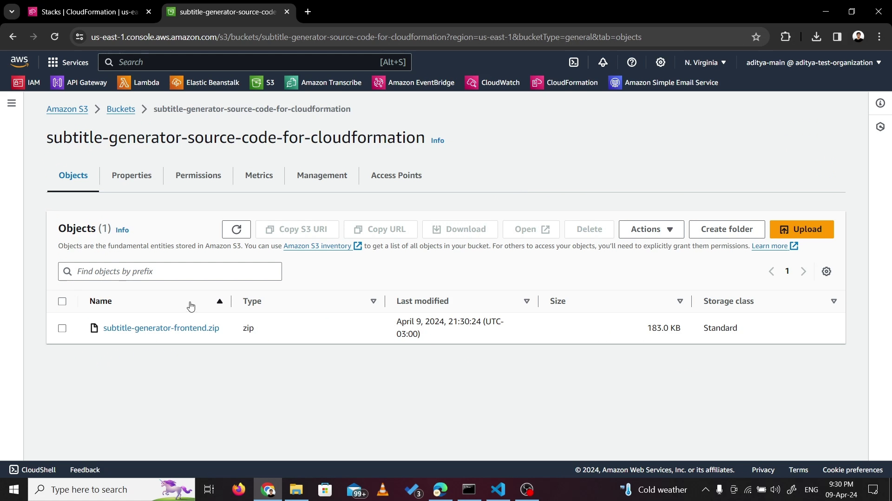

Elastic beanstalk will use this file to run the frontend on EC2. (This file name will be given as input along with bucket name, in CloudFormation Parameters)

 ### 2. Provision the AWS Resources.

2.1 Just create a stack in AWS CloudFormation usign the cloud-formation.yaml file given in this repository.

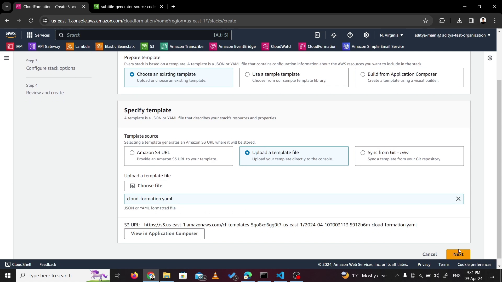

2.2 Give a name to stack, for eg: "SubtitleGeneratorStack" and give input parameters (default values should be good but feel free to modify if needed).

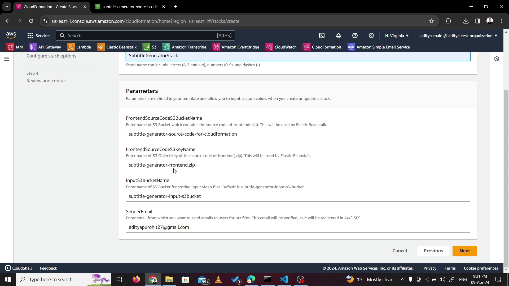

2.3 Wait for creation, once done, check the output params to get the frontend and backend URL.

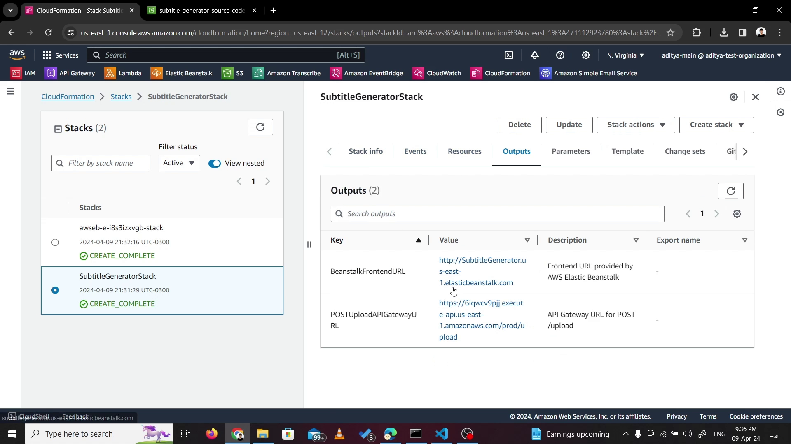

## Part-2: Using the Web App

### 1. Open the frontend, upload video.
- I have used a dummy email(joy...), different from my sender (adityapurohit27@gmail.com) for better understanding.

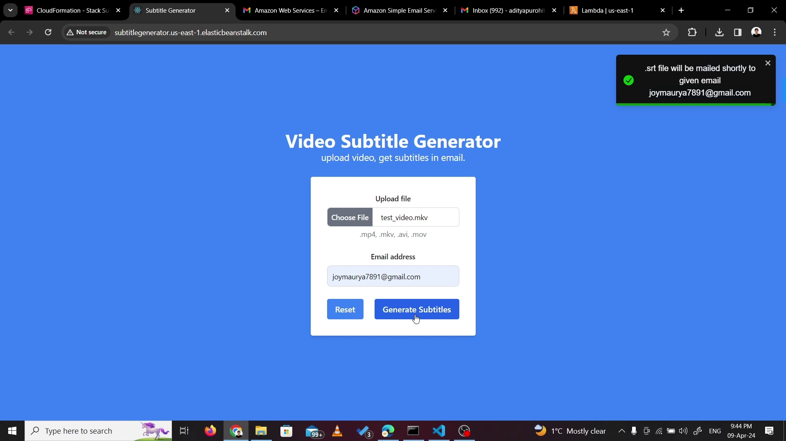

**Note**: In sandbox mode, SES will need the receiver email to be verified.

### 2. Wait for a while, download the .srt from email.

The email would contain a subtitle download link and the name of input video for reference.

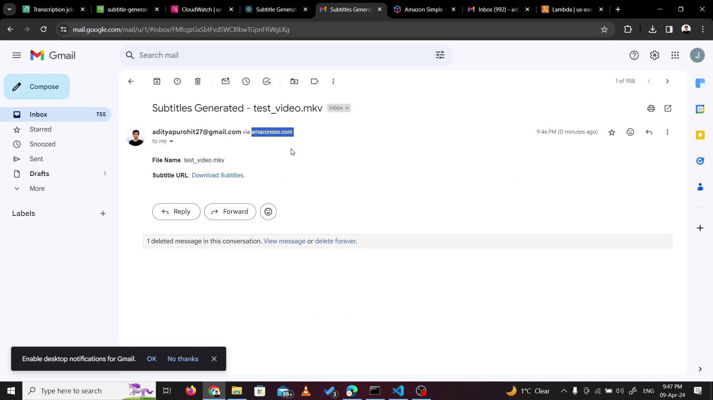

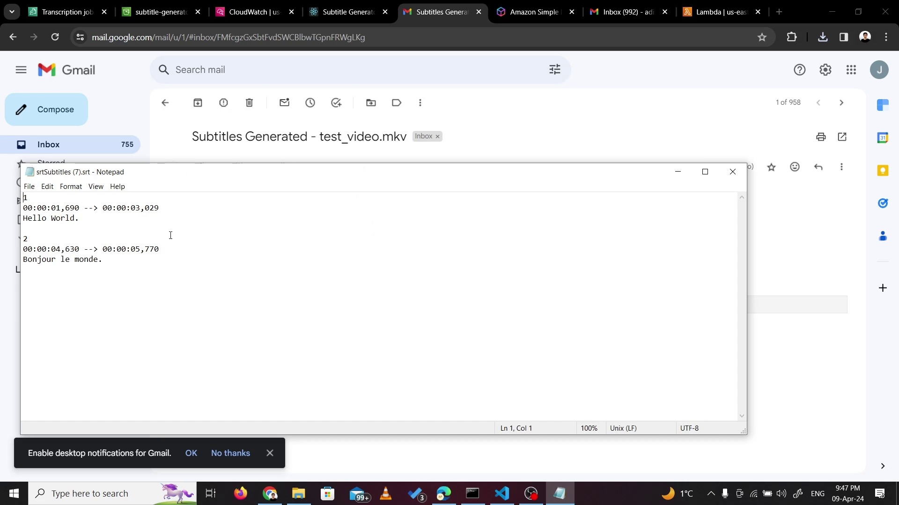

## Behind the Scenes

When the request is being processed, as performed in "Part-2: Using the Web App", below things can be seen happening in AWS Console.

- Input video file in S3 bucket.
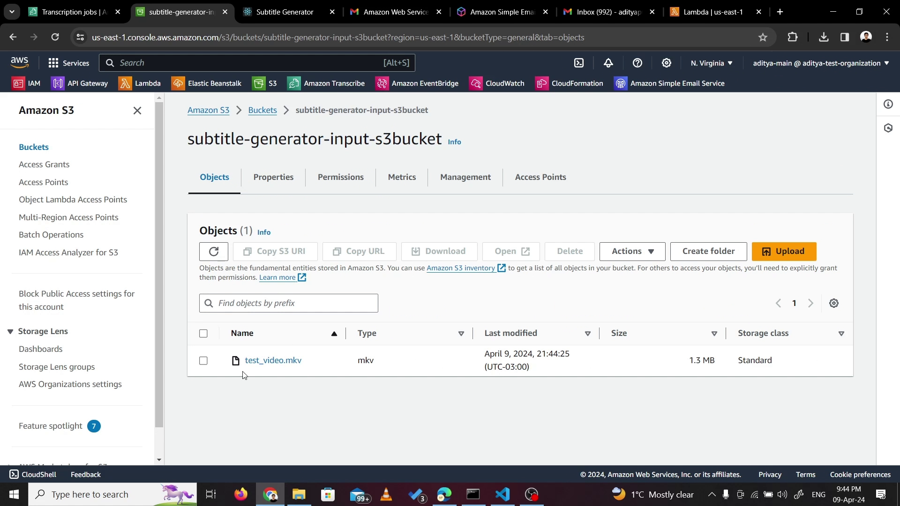

- A new Transcribe Job in progress.
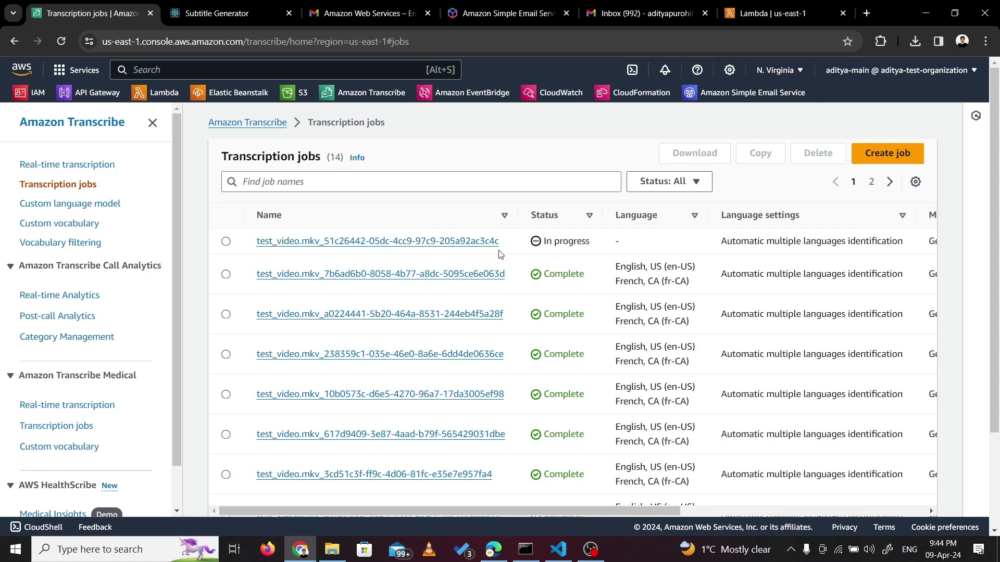

- Logs coming up in CloudWatch.
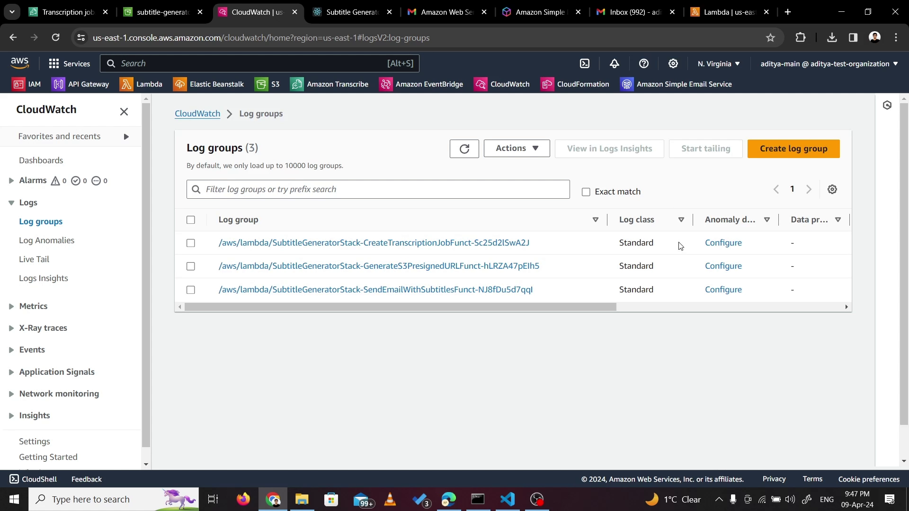

## Extras

### Video with full explanation, provisioning and demo.

Video Link: https://youtu.be/RzPbWkOi628

### Why pre-signed URL for S3?

For uploading videos directly to S3, without any bottlenecks from API Gateway or Lambda, I have used Pre-signed URLs, which are generated by Lambda for the frontend and then can be used for direct uploads. Although this URL is public, it is still highly secure because of the signature it holds after the generation. I have only allowed PUT operation on this URL nothing else, not even GET. Also, this URL will expire in 60 minutes to avoid any unauthorized uploads by any hacker, in case the URL is exposed. The signature will also enforce that only the email that was used earlier for requesting a pre-signed URL, is eligible for getting tagged to video during the upload. Also, the signed URL will restrict access to only a particular object in S3 Bucket and not all files. (Reference that I used to finalize this approach: https://aws.amazon.com/blogs/compute/patterns-for-building-an-api-to-upload-files-to-amazon-s3/)

## Notes

 - **Submitted by**: Aditya Maheshbhai Purohit (aditya.purohit@dal.ca)
B00952865

- **For**: CSCI 5409 Cloud Computing – Winter 2024 - Term Assignment